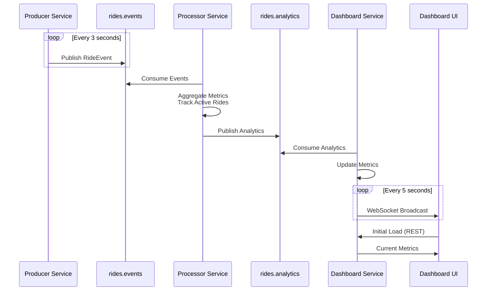

# StreamRide Architecture

## System Overview

StreamRide is a real-time ride analytics platform that processes ride events through Kafka Streams and delivers live analytics via WebSocket to a React dashboard.

---

## Architecture Diagram

)

---

## Data Flow

---

## Components

### Producer Service (Port 8081)
- Generates simulated ride events
- Publishes to `rides.events` topic every 3 seconds
- Event types: `RIDE_REQUESTED`, `RIDE_STARTED`, `RIDE_COMPLETED`

### Processor Service (Port 8082)
- Kafka Streams topology for real-time processing
- Aggregates metrics by city
- Tracks active rides (increment/decrement logic)
- Publishes to `rides.analytics` topic

### Dashboard Service (Port 8083)
- Consumes from `rides.analytics` topic
- Aggregates metrics in-memory
- Broadcasts to UI via WebSocket every 5 seconds
- REST API for initial data load

### Dashboard UI (Port 5173)
- React + TypeScript frontend
- WebSocket connection for live updates
- Displays real-time analytics and charts

### Apache Kafka (Port 9092)
- KRaft mode (no Zookeeper)
- 3 partitions per topic
- Replication factor: 1

### Kafdrop (Port 9000)
- Web UI for Kafka monitoring
- Browse topics and messages

---

## Technology Stack

| Component | Technology |
|-----------|-----------|
| Frontend | React 18, TypeScript, Vite |
| Backend | Spring Boot 3.x, Java 17 |
| Stream Processing | Kafka Streams |
| Message Broker | Apache Kafka (KRaft) |
| Monitoring | Kafdrop |
| Containerization | Docker Compose |

---

## Network & Ports

| Service | Port | Protocol |
|---------|------|----------|
| Dashboard UI | 5173 | HTTP |
| Producer Service | 8081 | HTTP |
| Processor Service | 8082 | HTTP |
| Dashboard Service | 8083 | HTTP/WebSocket |
| Kafka Broker | 9092 | Kafka |
| Kafdrop | 9000 | HTTP |

All services communicate via Docker network: `streamride-network`
